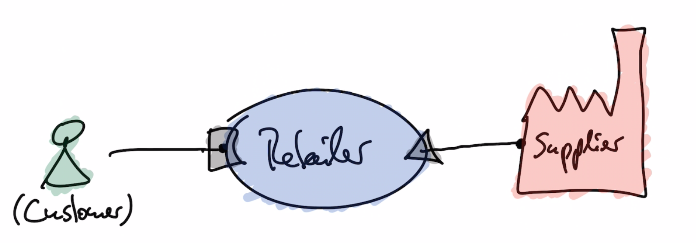
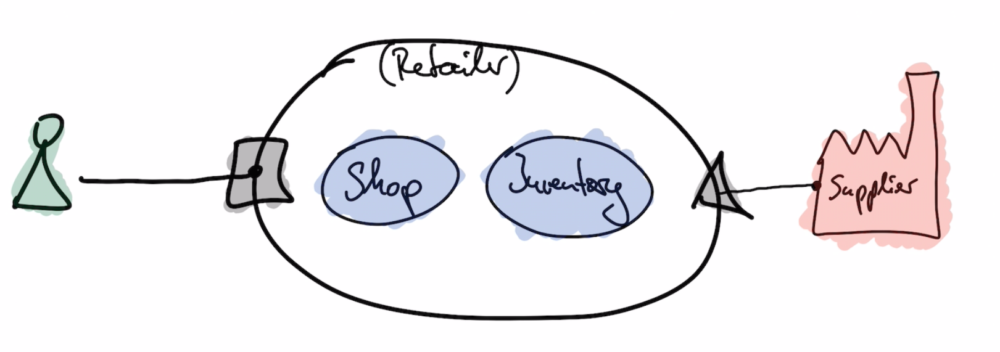
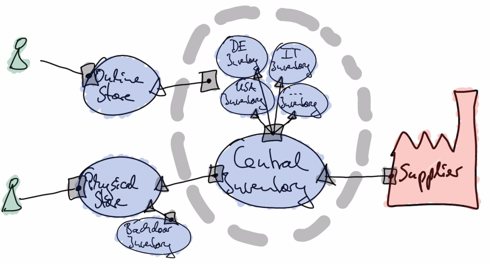

# Retail Shop - Getting Started With Gherkin

## The story

We have probably all experienced it: You are in a store shopping for groceries and are almost done with your list, when you arrive at the shelf where the canned tomatoes are supposed to be, and it’s empty.

Annoying right?

Viewing this from the perspective of a retailer and supplier, however, it is much more than that. 

These so-called Out of Stock (OOS) cost them millions of dollars annually. 

If this is the case, then why does it still happen so often? What needs to be done to solve the issue and can it really be solved once and for all in the future?

Let's discover how retailers and suppliers can better manage the OOS problem.

source:
* https://streetspotr.com/2017/08/14/out-of-stock/
* https://baymard.com/blog/handling-out-of-stock-products

### parties
* supplier
* retailer
* customer

### retailer
* central inventory
* physical store (has a backdoor inventory)
* online store (has inventories by country)
* sales cycle tracker

## Testing and Architecture

### features
* time travel
* notifications (async)
* mock service
* mock provider
* in-memory service

### testing mode
* gherkin tests
* manual tests (selenium) - @SomeDayMaybe

### architecture & methods
* acceptance tests best practices
* requirements engineering - discovery process (example mapping with three amigos, create a flow design)
* software cell - create modular components
* software universe - business features first, technical aspects second (do not get side-tracked by technical forces too fast)

### other components
* SalesCycleTracker
* CustomerNotifier
* PaymentProcessor
